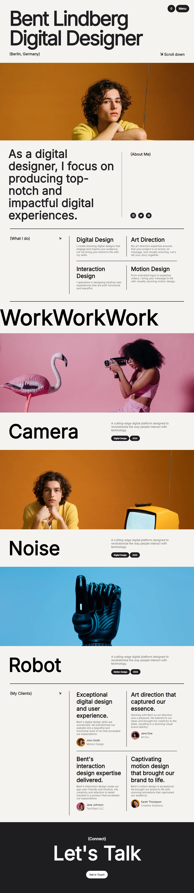

# Digital Designer Portfolio Clone

This project is a clone of the website [Bent Lindberg - Digital Designer](https://bent-template.webflow.io/), built as part of my journey into mastering HTML and CSS. The aim of the project was to replicate the original website's design and structure, helping me practice and enhance my frontend web development skills.

## Table of Contents

- [How to Run the Project](#how-to-run-the-project)
- [Overview](#overview)
- [Features](#features)
- [Technologies Used](#technologies-used)
- [Challenges Faced](#challenges-faced)
- [Lessons Learned](#lessons-learned)
- [Future Improvements](#future-improvements)
- [Acknowledgements](#acknowledgements)

## How to Run the Project

### Clone the repository:
git clone https://github.com/AbdulAhad114/Digital-designer-portfolio-clone.git

## Overview

This is a simple static website created using HTML and CSS, mimicking a professional digital designer's portfolio site. It showcases various sections such as:

- Hero section
- About me
- Services provided
- Portfolio section with images
- Testimonials from clients
- Contact information

## Features

- Clean typography and consistent layout.
- Hover effects for interactive elements like buttons and links.
- Structured sections with clear separation of content.
- Smooth scrolling between sections.
  
## Technologies Used

- **HTML5**: For structuring the content on the webpage.
- **CSS3**: For styling and layout, including flexbox and media queries for responsiveness.

## Challenges Faced

While working on this project, some of the main challenges I encountered were:

- **Replicating Exact Spacing**: Maintaining consistent spacing and alignment to closely match the original design.
- **Custom CSS Properties**: Understanding and using advanced CSS properties such as flexbox, media queries, and CSS transitions.

## Lessons Learned

- Improved understanding of HTML structure and the importance of semantic elements.
- Gained confidence in using CSS for layout and design, including media queries for responsiveness.
- Learned to replicate design details with precision, including typography and spacing.
- Deepened my understanding of debugging CSS issues using browser developer tools.

## Future Improvements

- JavaScript Animations: To make the site more interactive with scroll animations and transitions.
- CSS Optimizations: Further refinements in CSS to improve performance.
- Responsive Design